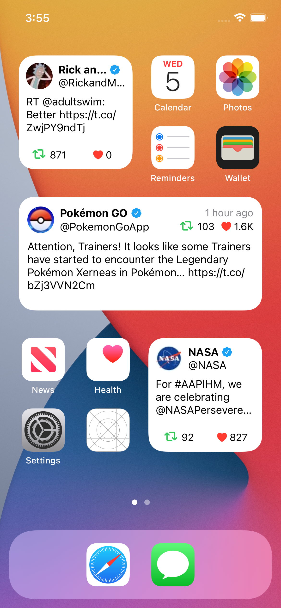
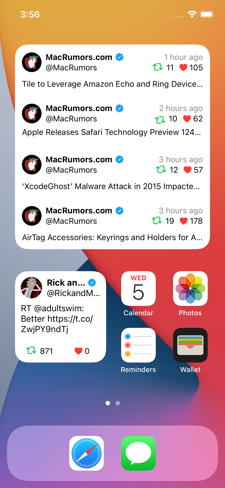

<h1 align="center">Twitter SwiftUI</h1>

<h4 align="center">Most recent Tweets, Retweets, replies, and Quote Tweets, similar to what may be seen on a user's profile timeline</h2>

## API
Twitter Developer API is available for free [here](https://developer.twitter.com/en). Replace API Key with yours.

## TODO
- [ ] Add placeholders
- [ ] Add Application

## Bug Reports
See [BUG REPORTS](.github/ISSUE_TEMPLATE/bug_report.md)

## Pull Requests
See [PULL REQUEST](.github/PULL_REQUEST_TEMPLATE/pull_request_template.md)

## Contributing
See [CONTRIBUTING](CONTRIBUTING.md)

## License
[LICENSE](LICENSE)